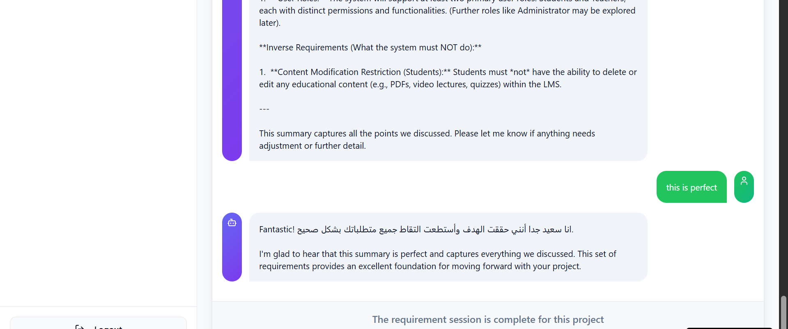
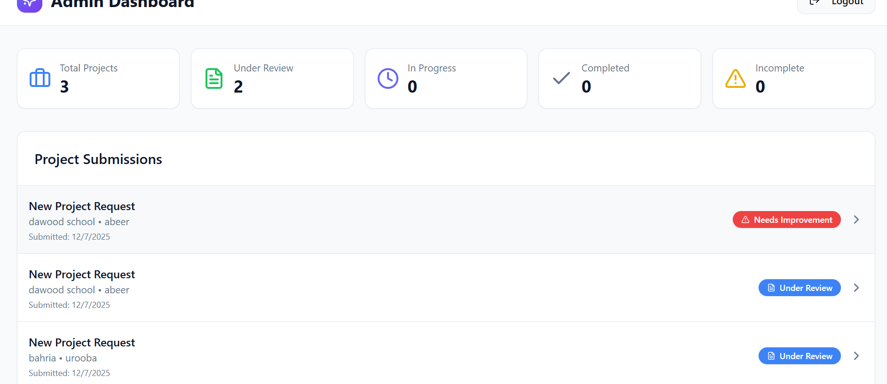
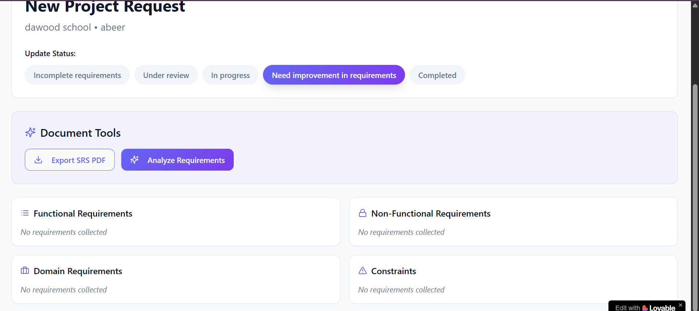
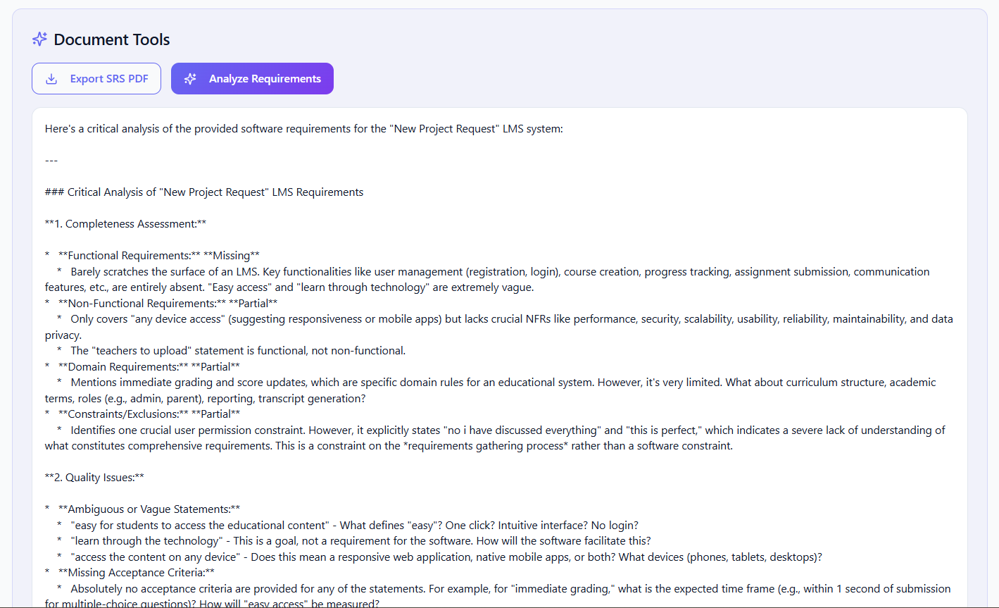

# Requira - Smart Requirement Gathering Assistant

[Requira Live Link](https://requira.lovable.app/)

---

## 🌟 Overview

**Requira** is an AI-powered web application that helps software developers and organizations efficiently gather project requirements from clients. It automates the requirement collection process using an intelligent chatbot and organizes the data for easy review and analysis by the development team.

---

## 🎯 Purpose

- Automate and streamline requirement gathering.
- Reduce repeated client meetings.
- Ensure all functional, non-functional, and domain-specific requirements are collected.
- Provide intelligent feedback on requirement completeness and ambiguity.
- Enable admins to manage project requirements and track progress in a centralized dashboard.

---

## 🧩 Key Features

### Client Side
- **Signup/Login:** Secure account creation for clients.
- **AI Chatbot:** Guides clients through structured questions to gather project requirements.
- **Session Completion Notification:** Alerts clients when the minimum requirements are collected.
- **Requirement Submission:** Ends the session and confirms submission with a clear message.

**Example Chatbot Interaction:**

---

### Admin Side
- **Secure Dashboard:** Access restricted to `requira.smartrequirementgatheringassistant@gmail.com` with password `admin123`.
- **Project Overview:** View all client submissions with status indicators.
- **Requirement Management:** Mark requirements as Complete, Incomplete, Under Review, In Progress, or Need Improvement.
- **AI Requirement Analyzer:** Checks completeness, ambiguity, and quality of submitted requirements.
- **Export PDF:** Generate organized requirement documents categorized into Functional, Non-Functional, Inverse, and Domain requirements.

**Admin Dashboard View:**

**Project Requirement Tab:**

**Requirement Analyzer Preview:**

---

## 👥 Users

- **Software Development Organizations:** Streamline requirement gathering and improve project clarity.
- **Clients / Project Requesters:** Submit project requirements easily without multiple meetings.
- **Project Managers / Admins:** Analyze, categorize, and track collected requirements efficiently.

---

## 🛠️ Technologies Used

- **Frontend:** React, TypeScript, Tailwind CSS, Vite
- **Backend & Database:** Supabase
- **AI Integration:** Chatbot and requirement analyzer
- **PDF Generation:** Organized PDF export
- **Authentication:** Secure login/signup for clients and admin

---

## ⚙️ How It Works

1. **Client Interaction:**
   - Client logs in or signs up.
   - Chatbot asks guided questions to collect detailed requirements.
   - Client submits requirements when finished.

2. **Admin Processing:**
   - Admin logs into the secure dashboard.
   - Reviews and categorizes collected requirements.
   - Uses AI analyzer to identify gaps or ambiguities.
   - Updates requirement status and exports PDF for the development team.

---

## ✅ Benefits

- Reduces repeated requirement gathering sessions.
- Provides structured and organized requirements.
- Enhances clarity between clients and developers.
- Centralized project tracking for admins.

---

## 🔗 Live Demo

Try Requira here: [https://requira.lovable.app/](https://requira.lovable.app/)

---

## 📸 Screenshots

- **Client Chatbot Interaction:** `public/screenshots/client_session_inprogress.png`
- **Admin Dashboard:** `public/screenshots/admin_dashboard_overview.png`
- **Project Requirements Tab:** `public/screenshots/admin_dashboard_project_details.png`
- **Requirement Analyzer:** `public/screenshots/analyzer_view.png`

---

## ✉️ Contact

For questions or support, contact:  
**Email:** uroobabatool06@gmail.com

---

## 📝 License

Open for academic and personal use.
